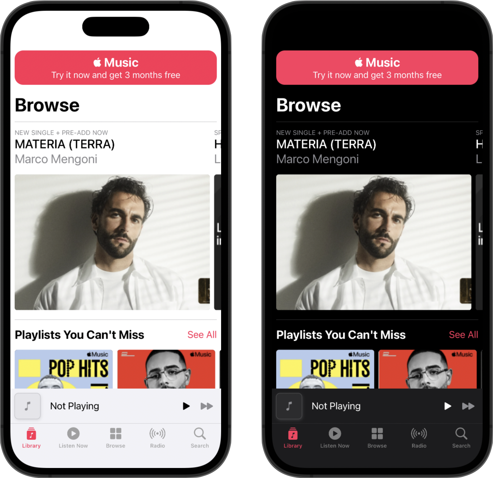
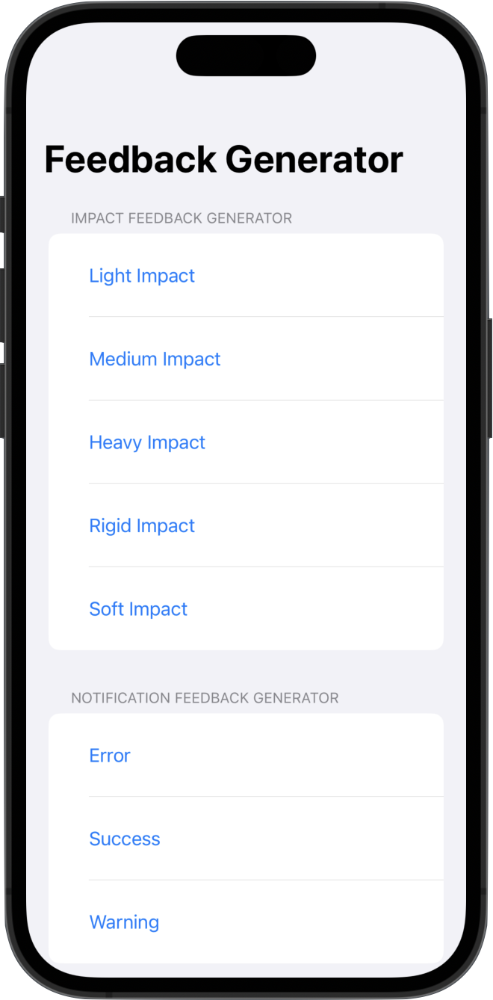

<div align="center">
  <h3>Session</h3>
  <h1>Make it Sensational</h1>
  <br />
  <a href="https://github.com/developer-academy-unina/Session-Make-it-Sensational/issues/new?assignees=&labels=bug&template=01_BUG_REPORT.md&title=bug%3A+">Report a Bug</a>
  ·
  <a href="https://github.com/developer-academy-unina/Session-Make-it-Sensational/discussions">Ask a Question</a>
  
</div>
  <br />
<p align="center">
  <a href="#" alt="Version">
    
  </a>
  <a href="#" alt="XCode Version">
    
  </a>        
  <a href="#" alt="Swift Version">
    
  </a>
  <a href="#" alt="Framework used">
    
  </a>          
</p>

<details open="open">
<summary>Table of Contents</summary>

- [About](#about)
- [Getting Started](#getting-started)
  - [Installation](#installation)
  - [How to](#how-to)
- [Issues and Discussions](#issues-and-discussions)
- [Support](#support)
- [Authors & contributors](#authors--contributors)
- [License](#license)

</details>

---
<br />

## About

These materials will introduce you to several ways to improve your user interface & user experience from both a technical and a design standpoint. Topics include colors and color palettes, typography and hierarchy, dark mode and contrast, feedback and haptic feedback, adaptiveness and live preview. 

<summary>Screenshots</summary>
<br>

|                               Make it Sensational App                               |                                  Haptic Feedback App                                          |
| :-------------------------------------------------------------------: | :--------------------------------------------------------------------: |
|  |  |

<br />

## Getting Started

### Installation

1. Clone the repo

   ```sh
   git clone https://github.com/developer-academy-unina/Session-Make-it-Sensational
   ```

2. Open the ```.xcodeproj``` file

### How to

1. Make it Sensational

In this project, it is possible to find the implementation of an app’s interface in which all the various principles explained during the activity are applied. Starting from Colors and Fonts, to Dark Mode and Haptic Feedbacks, the project shows all the necessary steps to make a plain app look fabulous respecting the Human Interface Guidelines.

2. HapticFeedback

In this project, it is possible to explore the use of Core Haptic, and the use of the Haptic Engine.
You will find some examples of how you can send haptic feedback, impact haptic, and even how you can create your custom patterns.

<br />

## Issues and Discussions

You've found a bug in the source code, a mistake in the documentation or maybe you'd like a new feature? Take a look at [GitHub Discussions](https://github.com/developer-academy-unina/Session-Make-it-Sensational/discussions) to see if it's already being discussed. You can help us by [submitting an issue on GitHub](https://github.com/developer-academy-unina/Session-Make-it-Sensational/issues). Before you create an issue, make sure to search the issue archive -- your issue may have already been addressed!

Please try to create bug reports that are:

- _Reproducible._ Include steps to reproduce the problem.
- _Specific._ Include as much detail as possible: which version, what environment, etc.
- _Unique._ Do not duplicate existing opened issues.
- _Scoped to a Single Bug._ One bug per report.

<br />

## Support

Reach out to the maintainer at one of the following places:

- [GitHub Discussions](https://github.com/developer-academy-unina/Session-Make-it-Sensational/discussions)
- [GitHub issues](https://github.com/developer-academy-unina/Session-Make-it-Sensational/issues/new?assignees=&labels=question&template=04_SUPPORT_QUESTION.md&title=support%3A+)
- Contact a Mentor for any other help

<br />

## Authors & contributors

The original setup of this repository is by [Gianluca Orpello](https://github.com/gorpello).

* [Gianluca Orpello](https://github.com/gorpello)
* [Luca Palmese](https://github.com/pal-luke)

For a full list of all authors and contributors, see [the contributors page](https://github.com/developer-academy-unina/Session-Make-it-Sensational/contributors).

<br />

## License

This project is licensed under the **MIT License**.

See [LICENSE](LICENSE) for more information.
